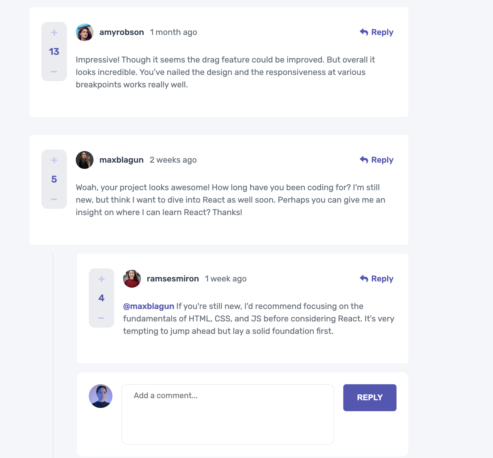

# Frontend Mentor - Interactive comments section solution

This is a solution to the [Interactive comments section challenge on Frontend Mentor](https://www.frontendmentor.io/challenges/interactive-comments-section-iG1RugEG9). Frontend Mentor challenges help you improve your coding skills by building realistic projects.

## Overview

### The challenge

Users should be able to:

- View the optimal layout for the app depending on their device's screen size
- See hover states for all interactive elements on the page
- Create, Read, Update, and Delete comments and replies
- Upvote and downvote comments
- **Bonus**: If you're building a purely front-end project, use `localStorage` to save the current state in the browser that persists when the browser is refreshed.
- **Bonus**: Instead of using the `createdAt` strings from the `data.json` file, try using timestamps and dynamically track the time since the comment or reply was posted.

### Screenshot

### Links

- [Repository URL:](https://github.com/mrLuisFer/interactive-comments)
<!-- - Live Site URL: [Add live site URL here](https://your-live-site-url.com) (WIP) -->

## My process

### Built with

- Semantic HTML5 markup
- CSS custom properties
- Flexbox
- CSS Grid
- [React](https://reactjs.org/) - JS library
- Sass - CSS preprocessor

### Continued development

In the future we will make some missing improvements like in the replies section where there is a bug to fix, but when time is available we will fix the bug

## Author

- Twitter - [@\_mrLuisFer](https://twitter.com/_mrLuisFer)
- Frontend Mentor - [@mrLuisFer](https://www.frontendmentor.io/profile/mrLuisFer)
- Website - [Personal and Custom Linktree](https://linktry-mrluisfer.vercel.app)
